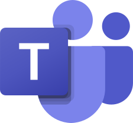
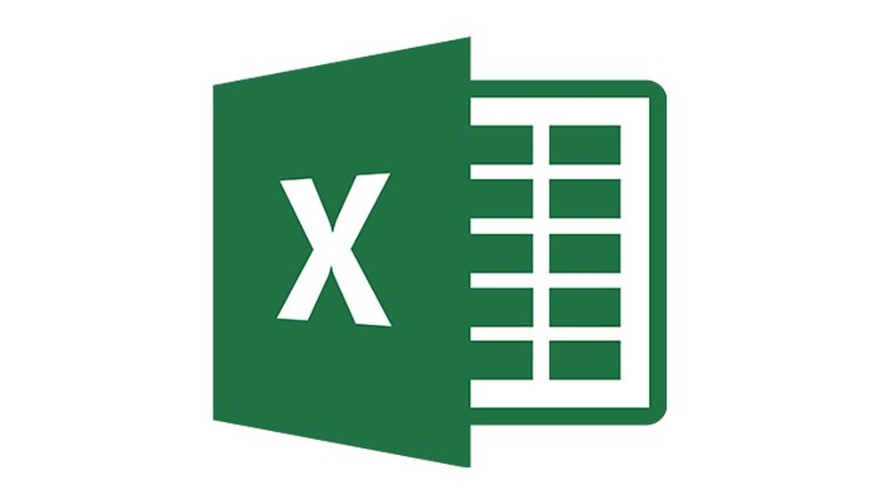

## Ferramentas

| Ferramenta | Descrição |
|-|-|
|| 
 O Git é uma ferramenta de versionamento de código utilizando para controle de versões de um software, mas pode ser empregado para registar o histórico de versões de qualquer arquivo.
|
|| 
GitHub é perfeito para a hospedagem remota de repositórios de código-fonte utilizando o Git e é também uma rede social utilizada amplamente pelos programadores espalhados pelo mundo. 
|| 
Optamos por utilizar o Telegram por sua praticidade em estabelecer uma comunicação em grupo e tendo em vista que todos os membros do grupo já utilizam essa plataforma para troca de mensagens.
|
|| 
O Trello se mostrou uma eficaz ferramenta de gestão de projeto, auxiliando na distribuição de atividades, no monitoramento do progresso de cada integrante do grupo e na produtividade em geral.
|
|| 
O YouTube é uma excelente plataforma para o compartilhamento de vídeos sobre os mais diversos conteúdos e será utilizado pelo grupo para disponibilização dos videos referentes as apresentações feitas ao longo do semestre.
|
|| 
O Figma é um eficaz software no processo de prototipagem de design de projetos, acessível de forma online ou por meio da sua instalação para desktop, disponível para sistemas operacionais GNU/Linux, MacOS ou Windows.
|
|| 
O Microsoft Teams é um aplicativo para reuniões oficial adotado pela Universidade de Brasília e será utilizado para realizar a gravação das apresentações.
|
|| 
O Excel é um aplicativo para a criação e edição de planilhas, utilizado pelo grupo para a criação do cronograma.
|
|| 
Visual Studio Code é uma ferramenta para a criação e edição de projetos nas mais diversas linguagens de programação, neste projeto ele é utilizado para criar e editar documentos em Markdown (.md).
|
|| 
O Discord é utilizado para as reuniões online do grupo para tratar sobre as Sprints e outros assuntos relacionados ao projeto.
|

## Histórico de versionamento

|Data|Versão|Descrição|Autor|
|-|-|-|-|
|03/02/2022|1.0.0|Criação da tabela de ferramentas.|[DouglasMonteles]('https://github.com/douglasmonteles')|
|11/02/2022|1.0.1|Adicionando as imagens.|[DouglasMonteles]('https://github.com/douglasmonteles')|
|11/02/2022|1.0.2|Adicionando mais algumas ferramentas.|[DouglasMonteles]('https://github.com/douglasmonteles')|
|11/02/2022|1.0.3|Corringindo a axibição de algumas imagens das ferramentas.|[DouglasMonteles]('https://github.com/douglasmonteles')|
|12/02/2022|1.0.3|Corringindo o caminho das imagens|[DouglasMonteles]('https://github.com/douglasmonteles')|
