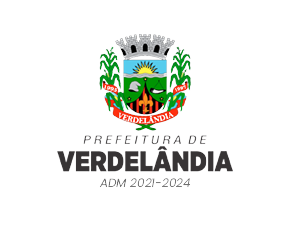

# Site Escolhido

<figure>

 
<figcaption>Figura 1 – Brasão da prefeitura de Verdelândia.</a></figcaption>
</figure>

##  Introdução

 O site escolhido para ser feito uma avaliação foi o da [Prefeitura de Verdelândia-MG] (http://www.verdelandia.mg.gov.br). O site possui diversas funcionalidades, assim como informar os moradores da cidade sobre todas as notícias da cidade, informações
sobre serviços, convênios, contatos, portal da transparência entre outros. 

## Objetivos

 Verificar através de perguntas se o site atende às necessidades do usuário.

 Sendo um site com informações oferecidas pela prefeitura, onde a população irá buscar informações relevantes, é de grande importância que a plataforma tenha
uma usabilidade e acessibilidade pensada para toda a população. 

## Perguntas a serem respondidas

 Perguntas que foram selecionadas. 

* O link leva para uma página esperada?
* Janelas do tipo Pop-up são evitadas no site?
* Ao clicar em algo com o cursor de clique o site tem alguma reação?
* Os redirecionamentos possuem um motivo para serem colocados na página?
* O design da página inicial é intuitivo?
* Há alguma redundância de conteúdo?
* O site possui poluição visual?
* O site tem uma identidade visual bem definida?
* O menu é acessível a qualquer momento?
* Todas as abas do site funcionam?

## Método de Avaliação

 O método escolhido foi o de inspeção, procurando possíveis falhas que o usuário vai encontrar durante a interação. Por meio do método de inspeção foi utilizada a avaliação heurística, de Nielsen. 

## Questões Éticas

 As questões éticas serão pautadas futuramente quando estabelecermos contato com o usuário.

## Versionamento

| Data | Versão | Descrição | Autor |
| - | - | - | - |
| 11/02/2022 | 1.0.0 | Criação da página do site escolhido. | Valderson Pontes e Antonio Igor |
| 13/02/2022 | 1.0.1 | Atualização da página. | Valderson Pontes |
